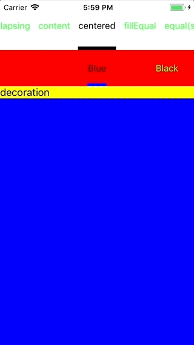
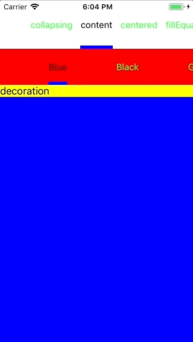
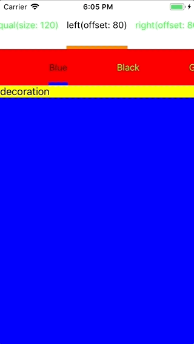
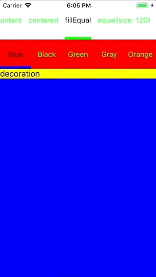
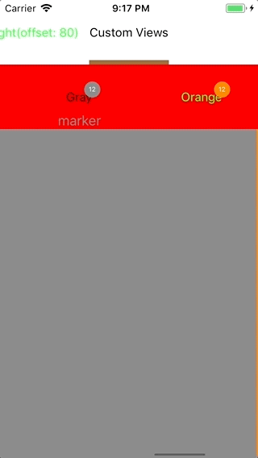
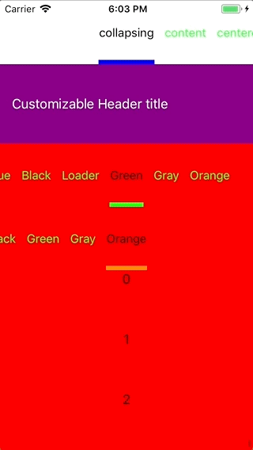

# Sundial

UICollectionView layout for paging navigation with header, which contains titles and selection marker on it.

[](https://travis-ci.org/sergeimikhan/Sundial)
[](http://cocoapods.org/pods/Sundial)
[](http://cocoapods.org/pods/Sundial)
[](http://cocoapods.org/pods/Sundial)

## Example

To run the example project, clone the repo, and run `pod install` from the Example directory first.

## Requirements

## Installation

Sundial is available through [CocoaPods](http://cocoapods.org). To install
it, simply add the following line to your Podfile:

```ruby
pod 'Sundial'
```

# Usage

## 1. Getting started

Sundial layout integrated in the same with regular UICollectionViewLayout:

```swift
  let collectionView = CollectionView<CollectionViewPagerSource>()

  collectionView.source.pager = self
  collectionView.collectionViewLayout = CollectionViewLayout(hostPagerSource: collectionView.source) { [weak self] in
    return ["Title1", "Title2", "Title3"]
  }
```

The only thing you need to do is to return array of titles and provide implementation of ```Selectable``` protocol. Pager sources of Astrolabe are conforms to this protocols out of box.

### 1.1 Settings

Sundial provides basic UI and behavior customization over Setting structure:

```swift
public struct Settings {
  public var stripHeight: CGFloat
  public var markerHeight: CGFloat
  public var itemMargin: CGFloat
  public var bottomStripSpacing: CGFloat
  public var backgroundColor: UIColor
  public var anchor: Anchor
  public var inset: UIEdgeInsets
  public var alignment: DecorationAlignment
  public var pagesOnScreen: Int
  public var jumpingPolicy: JumpingPolicy
 }
```

Cool feature of Sundial is 'jumping'. You can set jumping policy to skip pages when you are switching between pages which located far from each other and it looks like you are switching between neighbors:

<p align="center">
  
</p>

### 1.2 Anchors

Here is the list of possible anchors:

```swift
public enum Anchor {
  case content
  case centered
  case fillEqual
  case equal(size: CGFloat)
  case left(offset: CGFloat)
  case right(offset: CGFloat)
}
```

| Content | Centered |
| --- | --- |
| <p align="center"></p> | <p align="center"></p> |
| Left | Fill equal |
| <p align="center"></p> | <p align="center"></p> |

### 1.3 Custom decoration views

Here is definition of default decoration view in Sundial layout:

```swift
public typealias DecorationView = GenericDecorationView<TitleCollectionViewCell, MarkerDecorationView<TitleCollectionViewCell.Data>, DecorationViewAttributes<TitleCollectionViewCell.Data>>
public typealias CollectionViewLayout = GenericCollectionViewLayout<DecorationView>
public typealias CollapsingCollectionViewLayout = GenericCollapsingCollectionViewLayout<DecorationView>
```

As you can see here is possible to configure default decoration view itself providing another classes of ```TitleCell``` or ```MarkerCell``` . Or if necessary for your project decoration view itself if you need to provide another type decoration view conforming ```DecorationViewPageable``` protocol. For example:

```swift
  typealias CustomDecoration = GenericDecorationView<CustomTitleCollectionViewCell, CustomMarkerDecorationView, DecorationViewAttributes<CustomTitleCollectionViewCell.Data>>
  typealias CustomLayout = GenericCollectionViewLayout<CustomDecoration>
```

<p align="center">
  
</p>

## 2. Collapsing Header

Sundial also has layout for collapsing header - ```CollapsingCollectionViewLayout```. Creation is almost the same with ```CollectionViewLayout```. The only difference, that you need to provide implemenetations of ```CollapsingItem``` protocol.

```swift
  let collectionView = CollectionView<CollectionViewPagerSource>()
  typealias Layout = CollapsingCollectionViewLayout
  
  let items = [controller1, controller2, controllerLoader, controller4, controller5]
  let layout = Layout(items: items, hostPagerSource: collectionView.source) { [weak self] in
      return self?.titles ?? []
    }
```

Example of ```CollapsingItem``` implementation:

```swift
class TestViewController: UIViewController, Accessor, CollapsingItem {
  let visible = BehaviorRelay<Bool>(value: false)
  var scrollView: UIScrollView {
    return containerView
  }
```

Here is the result:

<p align="center">
  
</p>

## 0. Missing points 

1. More anchors
2. Ability to scroll UICollectionView inside decoration view

## License

Sundial is available under the MIT license. See the LICENSE file for more info.
